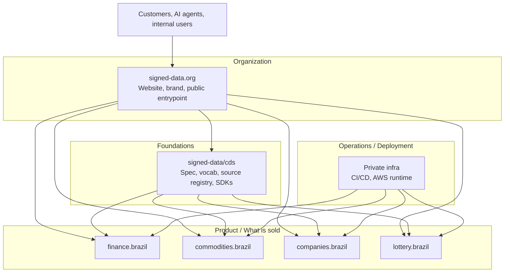

import { Aside } from '@astrojs/starlight/components';

A CDS deployment has four data layers and a Linked Data layer that connects them.
This page describes each layer, the trust model, and how the public `signed-data.org`
operator runs the products on top.

## Data flow

```
┌─────────────────────────────────────────────────────────┐
│                    Data sources                         │
│   Open-Meteo · Brapi · BCB · Caixa · CONAB · BrasilAPI  │
└────────────────────────┬────────────────────────────────┘
                         │ HTTP (no auth or API key)
┌────────────────────────▼────────────────────────────────┐
│                      Ingestor                           │
│   Fetches · fingerprints · normalises · signs           │
│   CDSSigner(private_key, issuer)                        │
└────────────────────────┬────────────────────────────────┘
                         │ CDSEvent (signed JSON-LD)
┌────────────────────────▼────────────────────────────────┐
│                   Transport / Store                     │
│   S3 (immutable) · EventBridge · HTTP · MCP             │
└────────────────────────┬────────────────────────────────┘
                         │
┌────────────────────────▼────────────────────────────────┐
│                     Consumer                            │
│   CDSVerifier(public_key) · MCP server · App · LLM      │
└─────────────────────────────────────────────────────────┘
```

## Layer 1 — Data sources

CDS only ingests from APIs with structured, reliable output. **No scraping.**
Every source is registered as a JSON-LD document at
`https://signed-data.org/sources/{source-id}`.

The raw API response is SHA-256 fingerprinted before parsing:

```
fingerprint = "sha256:" + SHA256(raw_response_bytes).hexdigest()
```

This is stored in `source.fingerprint` — it lets you prove what bytes were
received from the upstream, independent of the normalised payload.

## Layer 2 — Ingestor

The ingestor is the only component that holds the **private key**.

Responsibilities:

1. Fetch from source, capture raw bytes
2. Parse and normalise into the domain payload schema
3. Generate `context.summary` via a lightweight LLM (or rule-based logic)
4. Build the `CDSEvent` envelope with `@context`, `@type`, `@id`
5. Sign: compute canonical bytes → SHA-256 hash → RSA-PSS signature

```python
class BaseIngestor(ABC):
    async def fetch(self) -> list[CDSEvent]: ...  # implement per domain
    async def ingest(self) -> list[CDSEvent]:
        return [self.signer.sign(e) for e in await self.fetch()]
```

The ingestor is a producer. It runs on a schedule (cron) or on-demand.
Its output is a stream of signed `CDSEvent` objects.

## Layer 3 — Transport and store

CDS is transport-agnostic. Signed events are JSON-LD blobs — they can be:

- **Stored in S3** (append-only, partitioned by `domain/date/event_id`)
- **Routed via EventBridge** (by `domain` and `event_type`)
- **Served over HTTP** (Streamable HTTP MCP, ALB → ECS)
- **Embedded in MCP responses** (tools return the event dict)
- **Loaded into a triple store** (every event is valid RDF)

The signature is *inside* the event — it survives any transport. You can
copy the JSON to a database, a file, a message queue, or a response body
and the integrity guarantee is preserved.

## Layer 4 — Consumer

The consumer holds the **public key** only.

Before using any CDS event, a conformant consumer must call `CDSVerifier.verify()`.
This is a local operation — no network call, no trusted third party.

```python
verifier = CDSVerifier("keys/public.pem")
verifier.verify(event)  # raises ValueError or InvalidSignature
```

The public key can be distributed:

- In the SDK itself (for well-known issuers)
- Via `https://signed-data.org/.well-known/cds-public-key.pem`
- Out-of-band for private deployments

## Linked Data layer

Every CDS event is valid JSON-LD. The `@context` field maps snake_case JSON keys
to RDF predicates defined in the CDS vocabulary.

```
Event (@id)
  │
  ├── @context → /contexts/cds/v1.jsonld   (key mappings)
  ├── @type → /vocab/CuratedDataEvent      (class definition)
  ├── content_type → /vocab/{domain}/{schema}  (schema definition)
  └── source.@id → /sources/{id}           (source metadata)
                      │
                      └── domains → /vocab/{domain}/*  (domain vocabulary)
```

This link structure means any CDS event can be dereferenced: follow the URIs
to discover what the data is, where it came from, and what the fields mean.

See [Linked Data](/docs/linked-data/) for the full deep-dive.

## Trust model

The portfolio separates into four layers:



Only the website belongs in the Organization layer. All implementation lives in
**Foundations** (the standard and SDKs), **Product** (the domain-specific signed data
offerings), or **Operations** (the private runtime that builds, signs, and deploys).

The simplified trust statement:

```
Issuer (https://signed-data.org)  holds private key
       │ signs every event
Consumer (any app, Claude)        holds public key
       └── verifies every event
```

The issuer says: *"I fetched this data from that source, at this time. The payload
has not changed since I signed it."*

The consumer does not need to trust the transport, the database, the queue, or any
intermediary. The signature is the only trust anchor. This is the same model as code
signing, X.509 certificates, and GPG. The innovation is applying it to real-time
curated data feeds.

## MCP layer

An MCP server is a CDS **consumer** with a [Model Context Protocol](https://modelcontextprotocol.io)
interface on top. It verifies events, wraps them in tool responses, and exposes them
to Claude or any other MCP-compatible LLM client.

```
Claude Desktop
      │ MCP (Streamable HTTP / SSE / stdio)
MCP server (FastMCP)
      │ CDSVerifier.verify()
      │ CDSEvent JSON-LD
      └── returns dict to Claude
```

The MCP server does not hold the private key. **It only verifies.**

<Aside type="tip">
The deployed products at `*.mcp.signed-data.org` are stateless verifying consumers.
Every event you receive can be re-verified locally with the public key — you do not
have to trust the endpoint.
</Aside>

## Reference deployment

The reference operator deployment at `signed-data.org` runs each domain as a
small set of services:

- **Public MCP services** — `finance.mcp.signed-data.org`, `commodities.mcp.signed-data.org`,
  `companies.mcp.signed-data.org`, served over Streamable HTTP from a shared ALB
- **Scheduled ingestors** — fetch upstream APIs, sign events with the issuer key, persist to S3, fan out via EventBridge
- **Shared platform** — single signing key in Secrets Manager, single events bucket, single EventBridge bus
- **Linked Data endpoints** — `https://signed-data.org/vocab/...`, `/sources/...`, `/contexts/...`, `/.well-known/cds-public-key.pem`, served from CloudFront + S3

Source code for the public product logic lives in
[`signed-data/cds`](https://github.com/signed-data/cds) under `mcp/{finance,commodities,companies,lottery}`.
The private operator infrastructure lives in a separate deployment repo and provides
only the AWS runtime wrappers — image build, signing, ECS task definitions, CI/CD,
secrets wiring, and observability.
