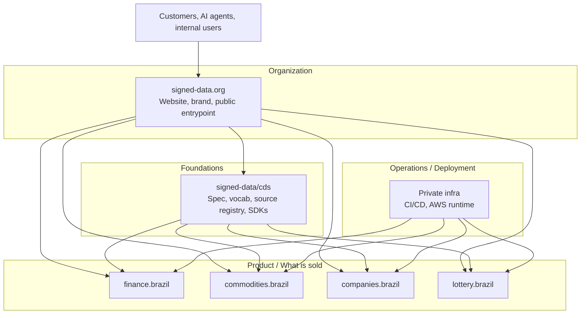

import { Aside } from '@astrojs/starlight/components';

Un despliegue CDS tiene cuatro capas de datos y una capa de Linked Data que las conecta.
Esta página describe cada capa, el modelo de confianza y cómo el operador público `signed-data.org`
ejecuta los productos sobre ellas.

## Flujo de datos

```
┌─────────────────────────────────────────────────────────┐
│                    Data sources                         │
│   Open-Meteo · Brapi · BCB · Caixa · CONAB · BrasilAPI  │
└────────────────────────┬────────────────────────────────┘
                         │ HTTP (no auth or API key)
┌────────────────────────▼────────────────────────────────┐
│                      Ingestor                           │
│   Fetches · fingerprints · normalises · signs           │
│   CDSSigner(private_key, issuer)                        │
└────────────────────────┬────────────────────────────────┘
                         │ CDSEvent (signed JSON-LD)
┌────────────────────────▼────────────────────────────────┐
│                   Transport / Store                     │
│   S3 (immutable) · EventBridge · HTTP · MCP             │
└────────────────────────┬────────────────────────────────┘
                         │
┌────────────────────────▼────────────────────────────────┐
│                     Consumer                            │
│   CDSVerifier(public_key) · MCP server · App · LLM      │
└─────────────────────────────────────────────────────────┘
```

## Capa 1 — Fuentes de datos

CDS solo ingiere desde APIs con salida estructurada y fiable. **Sin scraping.**
Cada fuente está registrada como un documento JSON-LD en
`https://signed-data.org/sources/{source-id}`.

A la respuesta cruda de la API se le calcula un fingerprint SHA-256 antes del parseo:

```
fingerprint = "sha256:" + SHA256(raw_response_bytes).hexdigest()
```

Esto se almacena en `source.fingerprint` — te permite probar qué bytes se
recibieron de la fuente upstream, con independencia del payload normalizado.

## Capa 2 — Ingestor

El ingestor es el único componente que posee la **clave privada**.

Responsabilidades:

1. Obtener desde la fuente, capturar bytes crudos
2. Parsear y normalizar al esquema de payload del dominio
3. Generar `context.summary` mediante un LLM ligero (o lógica basada en reglas)
4. Construir el envoltorio `CDSEvent` con `@context`, `@type`, `@id`
5. Firmar: calcular bytes canónicos → hash SHA-256 → firma RSA-PSS

```python
class BaseIngestor(ABC):
    async def fetch(self) -> list[CDSEvent]: ...  # implementar por dominio
    async def ingest(self) -> list[CDSEvent]:
        return [self.signer.sign(e) for e in await self.fetch()]
```

El ingestor es un productor. Se ejecuta de forma programada (cron) o bajo demanda.
Su salida es un flujo de objetos `CDSEvent` firmados.

## Capa 3 — Transporte y almacenamiento

CDS es agnóstico al transporte. Los eventos firmados son blobs JSON-LD — pueden:

- **Almacenarse en S3** (append-only, particionados por `domain/date/event_id`)
- **Enrutarse vía EventBridge** (por `domain` y `event_type`)
- **Servirse sobre HTTP** (MCP HTTP Streamable, ALB → ECS)
- **Embeberse en respuestas MCP** (las herramientas devuelven el dict del evento)
- **Cargarse en un triple store** (cada evento es RDF válido)

La firma está *dentro* del evento — sobrevive a cualquier transporte. Puedes
copiar el JSON a una base de datos, un archivo, una cola de mensajes o un cuerpo
de respuesta y la garantía de integridad se preserva.

## Capa 4 — Consumidor

El consumidor solo posee la **clave pública**.

Antes de usar cualquier evento CDS, un consumidor conforme debe llamar a `CDSVerifier.verify()`.
Esta es una operación local — sin llamada de red, sin terceros de confianza.

```python
verifier = CDSVerifier("keys/public.pem")
verifier.verify(event)  # lanza ValueError o InvalidSignature
```

La clave pública se puede distribuir:

- En el propio SDK (para emisores conocidos)
- Vía `https://signed-data.org/.well-known/cds-public-key.pem`
- Fuera de banda para despliegues privados

## Capa de Linked Data

Cada evento CDS es JSON-LD válido. El campo `@context` mapea las claves JSON snake_case
a predicados RDF definidos en el vocabulario CDS.

```
Event (@id)
  │
  ├── @context → /contexts/cds/v1.jsonld   (key mappings)
  ├── @type → /vocab/CuratedDataEvent      (class definition)
  ├── content_type → /vocab/{domain}/{schema}  (schema definition)
  └── source.@id → /sources/{id}           (source metadata)
                      │
                      └── domains → /vocab/{domain}/*  (domain vocabulary)
```

Esta estructura de enlaces significa que cualquier evento CDS se puede dereferenciar: sigue los URIs
para descubrir qué son los datos, de dónde provienen y qué significan los campos.

Consulta [Linked Data](/docs/linked-data/) para la inmersión completa.

## Modelo de confianza

El portafolio se separa en cuatro capas:



Solo el sitio web pertenece a la capa Organización. Toda la implementación vive en
**Foundations** (el estándar y los SDKs), **Product** (las ofertas de datos firmados específicas
del dominio) o **Operations** (el runtime privado que construye, firma y despliega).

La declaración de confianza simplificada:

```
Issuer (https://signed-data.org)  holds private key
       │ signs every event
Consumer (any app, Claude)        holds public key
       └── verifies every event
```

El emisor dice: *"Obtuve estos datos de esa fuente, en este momento. El payload
no ha cambiado desde que lo firmé."*

El consumidor no necesita confiar en el transporte, la base de datos, la cola ni en ningún
intermediario. La firma es la única ancla de confianza. Este es el mismo modelo que la firma
de código, los certificados X.509 y GPG. La innovación es aplicarlo a feeds de datos
curados en tiempo real.

## Capa MCP

Un servidor MCP es un **consumidor** CDS con una interfaz [Model Context Protocol](https://modelcontextprotocol.io)
encima. Verifica eventos, los envuelve en respuestas de herramientas y los expone
a Claude o cualquier otro cliente LLM compatible con MCP.

```
Claude Desktop
      │ MCP (Streamable HTTP / SSE / stdio)
MCP server (FastMCP)
      │ CDSVerifier.verify()
      │ CDSEvent JSON-LD
      └── returns dict to Claude
```

El servidor MCP no posee la clave privada. **Solo verifica.**

<Aside type="tip">
Los productos desplegados en `*.mcp.signed-data.org` son consumidores verificadores sin estado.
Cada evento que recibas se puede re-verificar localmente con la clave pública — no
tienes que confiar en el endpoint.
</Aside>

## Despliegue de referencia

El despliegue del operador de referencia en `signed-data.org` ejecuta cada dominio como un
pequeño conjunto de servicios:

- **Servicios MCP públicos** — `finance.mcp.signed-data.org`, `commodities.mcp.signed-data.org`,
  `companies.mcp.signed-data.org`, servidos sobre HTTP Streamable desde un ALB compartido
- **Ingestores programados** — obtienen las APIs upstream, firman eventos con la clave del emisor, persisten en S3, distribuyen vía EventBridge
- **Plataforma compartida** — única clave de firma en Secrets Manager, único bucket de eventos, único bus EventBridge
- **Endpoints de Linked Data** — `https://signed-data.org/vocab/...`, `/sources/...`, `/contexts/...`, `/.well-known/cds-public-key.pem`, servidos desde CloudFront + S3

El código fuente de la lógica del producto público vive en
[`signed-data/cds`](https://github.com/signed-data/cds) bajo `mcp/{finance,commodities,companies,lottery}`.
La infraestructura privada del operador vive en un repositorio de despliegue separado y proporciona
solo los wrappers del runtime AWS — construcción de imágenes, firma, definiciones de tareas ECS, CI/CD,
cableado de secretos y observabilidad.
