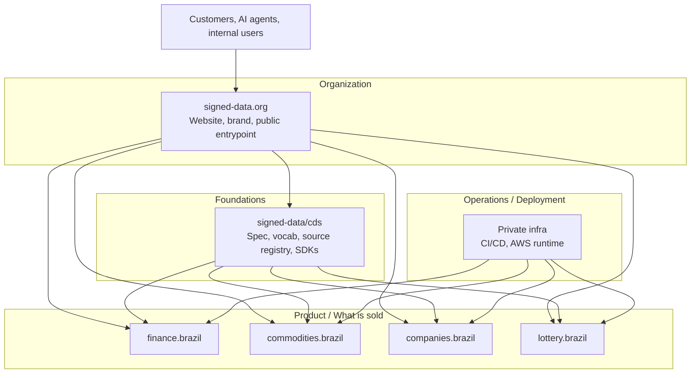

import { Aside } from '@astrojs/starlight/components';

Uma implantação CDS tem quatro camadas de dados e uma camada de Linked Data que as conecta.
Esta página descreve cada camada, o modelo de confiança e como o operador público `signed-data.org`
roda os produtos sobre ele.

## Fluxo de dados

```
┌─────────────────────────────────────────────────────────┐
│                    Data sources                         │
│   Open-Meteo · Brapi · BCB · Caixa · CONAB · BrasilAPI  │
└────────────────────────┬────────────────────────────────┘
                         │ HTTP (no auth or API key)
┌────────────────────────▼────────────────────────────────┐
│                      Ingestor                           │
│   Fetches · fingerprints · normalises · signs           │
│   CDSSigner(private_key, issuer)                        │
└────────────────────────┬────────────────────────────────┘
                         │ CDSEvent (signed JSON-LD)
┌────────────────────────▼────────────────────────────────┐
│                   Transport / Store                     │
│   S3 (immutable) · EventBridge · HTTP · MCP             │
└────────────────────────┬────────────────────────────────┘
                         │
┌────────────────────────▼────────────────────────────────┐
│                     Consumer                            │
│   CDSVerifier(public_key) · MCP server · App · LLM      │
└─────────────────────────────────────────────────────────┘
```

## Camada 1 — Fontes de dados

O CDS só ingere a partir de APIs com saída estruturada e confiável. **Sem scraping.**
Toda fonte é registrada como um documento JSON-LD em
`https://signed-data.org/sources/{source-id}`.

A resposta bruta da API é fingerprintada com SHA-256 antes do parsing:

```
fingerprint = "sha256:" + SHA256(raw_response_bytes).hexdigest()
```

Isso é armazenado em `source.fingerprint` — permite provar quais bytes foram
recebidos do upstream, independentemente do payload normalizado.

## Camada 2 — Ingestor

O ingestor é o único componente que detém a **chave privada**.

Responsabilidades:

1. Buscar a fonte, capturar bytes brutos
2. Fazer parsing e normalizar para o schema de payload do domínio
3. Gerar `context.summary` via um LLM leve (ou lógica baseada em regras)
4. Construir o envelope `CDSEvent` com `@context`, `@type`, `@id`
5. Assinar: calcular bytes canônicos → hash SHA-256 → assinatura RSA-PSS

```python
class BaseIngestor(ABC):
    async def fetch(self) -> list[CDSEvent]: ...  # implementar por domínio
    async def ingest(self) -> list[CDSEvent]:
        return [self.signer.sign(e) for e in await self.fetch()]
```

O ingestor é um produtor. Ele roda em uma agenda (cron) ou sob demanda.
Sua saída é um stream de objetos `CDSEvent` assinados.

## Camada 3 — Transporte e armazenamento

O CDS é agnóstico de transporte. Eventos assinados são blobs JSON-LD — eles podem ser:

- **Armazenados no S3** (append-only, particionados por `domain/date/event_id`)
- **Roteados via EventBridge** (por `domain` e `event_type`)
- **Servidos sobre HTTP** (Streamable HTTP MCP, ALB → ECS)
- **Embutidos em respostas MCP** (ferramentas retornam o dict do evento)
- **Carregados em um triple store** (todo evento é RDF válido)

A assinatura está *dentro* do evento — ela sobrevive a qualquer transporte. Você pode
copiar o JSON para um banco de dados, um arquivo, uma fila de mensagens ou um corpo de resposta
e a garantia de integridade é preservada.

## Camada 4 — Consumidor

O consumidor detém apenas a **chave pública**.

Antes de usar qualquer evento CDS, um consumidor conforme DEVE chamar `CDSVerifier.verify()`.
Esta é uma operação local — sem chamada de rede, sem terceiros confiáveis.

```python
verifier = CDSVerifier("keys/public.pem")
verifier.verify(event)  # lança ValueError ou InvalidSignature
```

A chave pública pode ser distribuída:

- No próprio SDK (para emissores bem conhecidos)
- Via `https://signed-data.org/.well-known/cds-public-key.pem`
- Fora de banda para implantações privadas

## Camada de Linked Data

Todo evento CDS é um JSON-LD válido. O campo `@context` mapeia chaves JSON snake_case
para predicados RDF definidos no vocabulário CDS.

```
Event (@id)
  │
  ├── @context → /contexts/cds/v1.jsonld   (key mappings)
  ├── @type → /vocab/CuratedDataEvent      (class definition)
  ├── content_type → /vocab/{domain}/{schema}  (schema definition)
  └── source.@id → /sources/{id}           (source metadata)
                      │
                      └── domains → /vocab/{domain}/*  (domain vocabulary)
```

Essa estrutura de links significa que qualquer evento CDS pode ser dereferenciado: siga as URIs
para descobrir o que é o dado, de onde ele veio e o que os campos significam.

Veja [Linked Data](/docs/linked-data/) para o aprofundamento completo.

## Modelo de confiança

O portfólio se separa em quatro camadas:



Apenas o site pertence à camada Organização. Toda a implementação vive em
**Foundations** (a especificação e os SDKs), **Product** (as ofertas de dados assinados específicas
de domínio) ou **Operations** (o runtime privado que constrói, assina e implanta).

A declaração de confiança simplificada:

```
Issuer (https://signed-data.org)  holds private key
       │ signs every event
Consumer (any app, Claude)        holds public key
       └── verifies every event
```

O emissor diz: *"Eu busquei esse dado daquela fonte, neste momento. O payload
não mudou desde que eu o assinei."*

O consumidor não precisa confiar no transporte, no banco de dados, na fila ou em qualquer
intermediário. A assinatura é a única âncora de confiança. Este é o mesmo modelo de assinatura
de código, certificados X.509 e GPG. A inovação é aplicá-lo a feeds curados de dados em tempo real.

## Camada MCP

Um servidor MCP é um **consumidor** CDS com uma interface [Model Context Protocol](https://modelcontextprotocol.io)
por cima. Ele verifica eventos, os encapsula em respostas de ferramentas e os expõe
para o Claude ou qualquer outro cliente LLM compatível com MCP.

```
Claude Desktop
      │ MCP (Streamable HTTP / SSE / stdio)
MCP server (FastMCP)
      │ CDSVerifier.verify()
      │ CDSEvent JSON-LD
      └── returns dict to Claude
```

O servidor MCP não detém a chave privada. **Ele apenas verifica.**

<Aside type="tip">
Os produtos implantados em `*.mcp.signed-data.org` são consumidores verificadores stateless.
Todo evento que você recebe pode ser re-verificado localmente com a chave pública — você não
precisa confiar no endpoint.
</Aside>

## Implantação de referência

A implantação do operador de referência em `signed-data.org` roda cada domínio como um
pequeno conjunto de serviços:

- **Serviços MCP públicos** — `finance.mcp.signed-data.org`, `commodities.mcp.signed-data.org`,
  `companies.mcp.signed-data.org`, servidos sobre Streamable HTTP a partir de um ALB compartilhado
- **Ingestores agendados** — buscam APIs upstream, assinam eventos com a chave do emissor, persistem em S3, distribuem via EventBridge
- **Plataforma compartilhada** — chave única de assinatura no Secrets Manager, único bucket de eventos, único bus do EventBridge
- **Endpoints de Linked Data** — `https://signed-data.org/vocab/...`, `/sources/...`, `/contexts/...`, `/.well-known/cds-public-key.pem`, servidos a partir de CloudFront + S3

O código-fonte da lógica de produto pública vive em
[`signed-data/cds`](https://github.com/signed-data/cds) sob `mcp/{finance,commodities,companies,lottery}`.
A infraestrutura privada do operador vive em um repositório de implantação separado e fornece
apenas os wrappers do runtime AWS — build de imagem, assinatura, definições de tasks ECS, CI/CD,
configuração de segredos e observabilidade.
